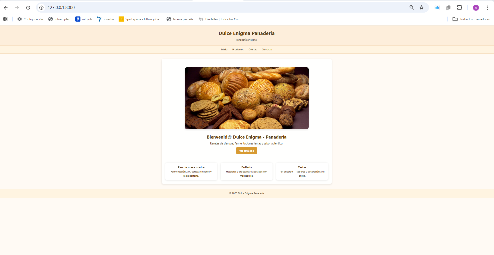
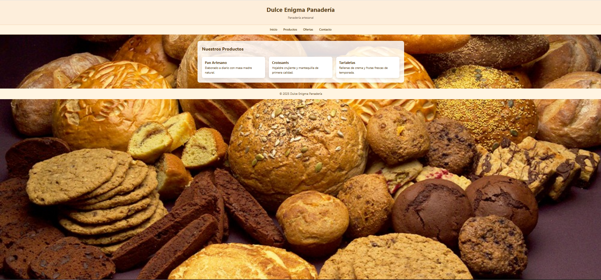
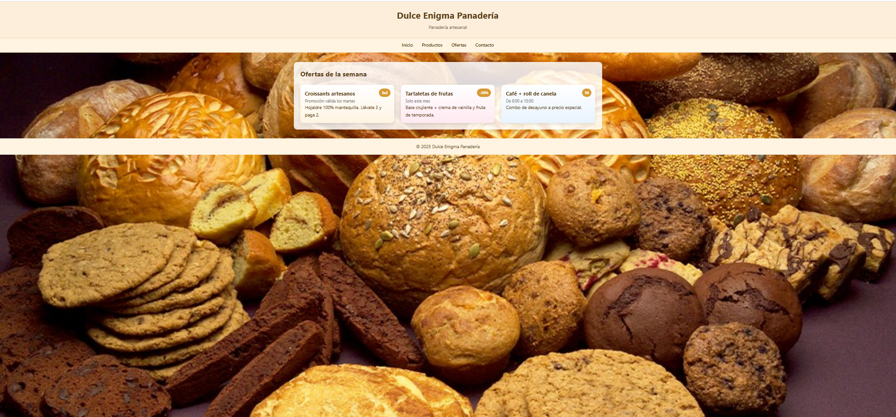
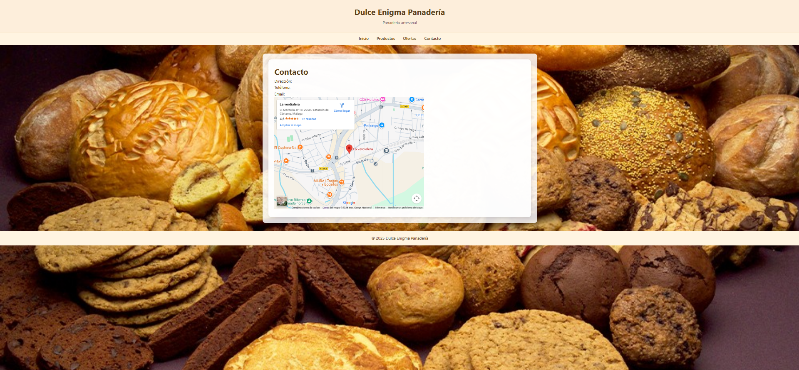

🥖 Panadería Dulce Enigma

    Landing page desarrollada con Django para una panadería artesanal.
    El proyecto muestra un diseño limpio, sencillo y funcional, ideal como práctica de introducción al framework Django.

🧰 Tecnologías utilizadas

    Tecnología	Descripción
    🐍 Python	Lenguaje de programación principal.
    🌐 Django	Framework web utilizado para el desarrollo de la aplicación.
    🧩 HTML5	Estructura del contenido de la página.
    🎨 CSS3	    Estilos y diseño visual del sitio.

📚 Proyecto académico

   💡 Proyecto realizado para la asignatura
   “Desarrollo de aplicaciones web en el entorno servidor”

   📜 Incluido en el
   Certificado de Profesionalidad IFCD2010 — Desarrollo de Aplicaciones con Tecnología Web

   🏫 Centro: CPIFP Alan Turing

   👨‍🏫 Profesor: Luis José Sánchez González

🌟 Características principales

   Diseño adaptable con HTML5 + CSS3

   Estructura Django organizada (templates, static, views)

   Secciones:

             🏠 Inicio

             🥐 Productos

             💸 Ofertas

             📩 Contacto (con formulario y mapa integrado)

   Gestión de archivos estáticos y plantillas extendidas con base.html

   Fondo personalizado para páginas interiores

🖼️ Galería de vistas
   
   🏠 Inicio

   

   🥐 Productos

   

   💸 Ofertas

   

   📩 Contacto

   

